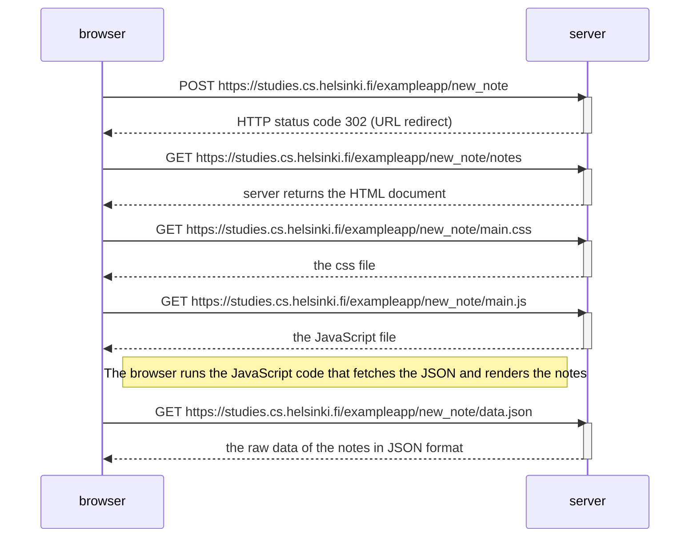

```mermaid
sequenceDiagram
    participant browser
    participant server

    browser->>server: POST https://studies.cs.helsinki.fi/exampleapp/new_note
    activate server
    server-->>browser: HTTP status code 302 (URL redirect)
    deactivate server

    browser->>server: GET https://studies.cs.helsinki.fi/exampleapp/new_note/notes
    activate server
    server-->>browser: server returns the HTML document
    deactivate server

    browser->>server: GET https://studies.cs.helsinki.fi/exampleapp/new_note/main.css
    activate server
    server-->>browser: the css file
    deactivate server

    browser->>server: GET https://studies.cs.helsinki.fi/exampleapp/new_note/main.js
    activate server
    server-->>browser: the JavaScript file
    deactivate server

    Note right of browser: The browser runs the JavaScript code that fetches the JSON and renders the notes

    browser->>server: GET https://studies.cs.helsinki.fi/exampleapp/new_note/data.json
    activate server
    server-->>browser: the raw data of the notes in JSON format
    deactivate server
```