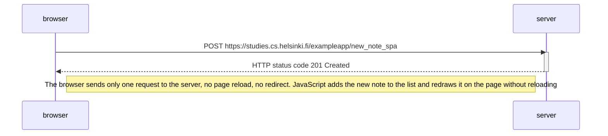

```mermaid
sequenceDiagram
    participant browser
    participant server

    browser->>server: POST https://studies.cs.helsinki.fi/exampleapp/new_note_spa
    activate server
    server-->>browser: HTTP status code 201 Created
    deactivate server

    Note right of browser: The browser sends only one request to the server, no page reload, no redirect. JavaScript adds the new note to the list and redraws it on the page without reloading
```